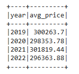
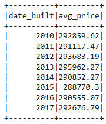
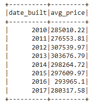
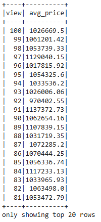

# Home_Sales
## Overview of the Analysis
This project uses SparkSQL to analyse home sales data from 2019 to 2022. The data is loaded from an S3 bucket . The goal is to determine key metrics about home sales, such as average prices and view ratings, and comparing the cached runtime and parqueit runtime. The project involves creating temporary views, partitioning the data, caching and uncaching a temporary table, and verifying that the table has been uncached.
The analysis is done in the Home_Sales.ipynb notebook.

## Results
I analysed the data to answer the following questions:


What is the average price for a four-bedroom house sold for each year?

    ```sql
    SELECT 
        YEAR(date) AS year,
        ROUND(AVG(price),2) As avg_price
    FROM home_sales
    WHERE bedrooms=4
    GROUP BY year
    ORDER BY year
    ```
    


What is the average price of a home for each year it was built that has three bedrooms and three bathrooms?

    ```sql
    SELECT
        date_built, 
        ROUND(AVG(price), 2) AS avg_price
    FROM home_sales
    WHERE bedrooms=3 AND bathrooms=3
    GROUP BY date_built
    ORDER BY date_built
    ```


What is the average price of a home for each year that has three bedrooms, three bathrooms, two floors, and is greater than or equal to 2,000 square feet?

    ```sql
    SELECT
        date_built, 
        ROUND(AVG(price), 2) AS avg_price
    FROM home_sales
    WHERE bedrooms=3 AND bathrooms=3
    GROUP BY date_built
    ORDER BY date_built
    ```


What is the "view" rating for the average price of a home where the homes are greater than or equal to $350,000?

    ```sql
    SELECT 
        view,
        ROUND(AVG(price), 2) AS avg_price
    FROM home_sales
    GROUP BY view
    HAVING avg_price >= 350000
    ORDER BY view DESC
    ```



Using the cached data, run the last query that calculates the average price of a home per "view" rating having an average home price greater than or equal to $350,000. Determine the runtime and compare it to uncached runtime.

**Standard runtime for Q4** :  0.79 seconds

**Cached runtime for Q4** :  0.46 seconds

**Parquet runtime for Q4** : 1.15 seconds

## Summary
Query performance was significantly influenced by data storage format. Cached tables, with their in-memory access, offered the fastest execution time (0.46s). Partitioned Parquet files, while efficient for storage, were slower (0.79s). This performance discrepancy can be attributed to both disk I/O and the suboptimal partitioning strategy on the "date_built" column, which was irrelevant to the query.
